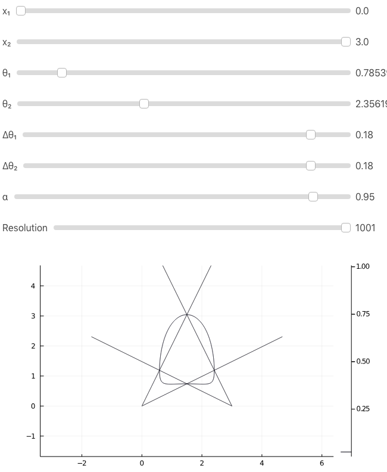

# bearingDistributions.jl

Visualizing the intersection of multiple angle measurements with known angle measurement distributions.

Provides a web application via `App.julia_main()` that runs a web application for visualization on `localhost:8000`

